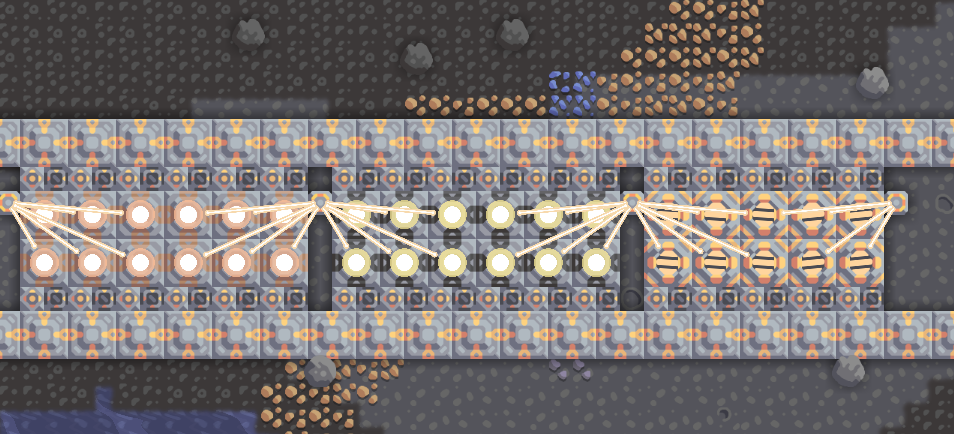

# Container Chaining

Brings back the container chaining mechanic from Mindustry v4 beta

Current limitations:
- saving, connecting to a server will result in rounding errors in the save or desync in the client, losing you some items depending on the amount of containers you have
- containers cannot connect to core

